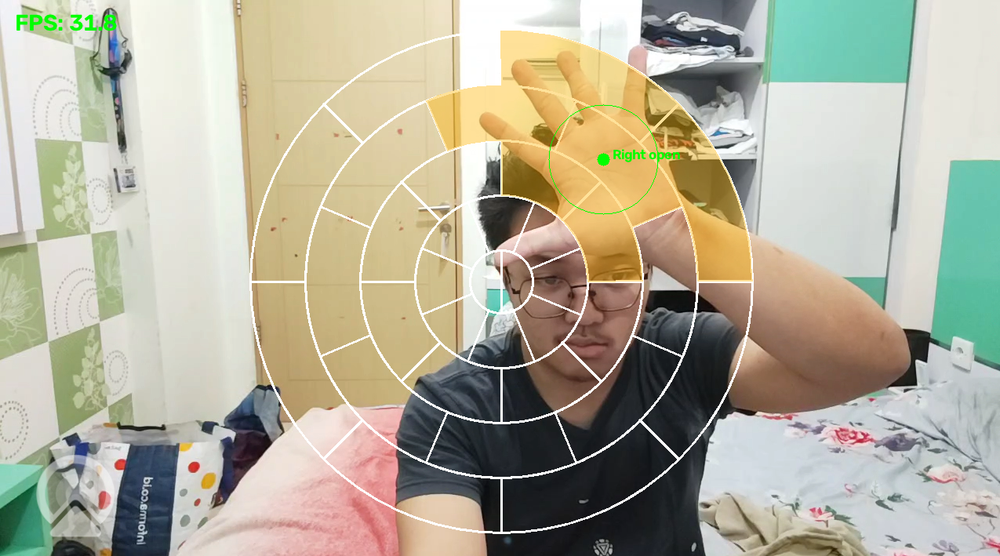

# Maimai-PCV

Hand tracking pakai webcam yang memetakan posisi kedua telapak tangan ke papan
sensor ala maimai, lalu membaca tap dan hold dari kepalan tangan. Tugas mata
kuliah PCV (semester 5).

Idenya: arahkan kamera ke diri sendiri, lalu program menentukan posisi tiap
tangan di atas layout maimai virtual, apakah tangan sedang mengepal, dan berapa
lama. Untuk sekarang event-nya baru dicetak ke console — menyambungkannya ke
output tombol / chart adalah langkah berikutnya.

Semua kode masih di dalam satu file `test.py`.

## Cara menjalankan

```
python test.py
```

Butuh file `hand_landmarker.task` di folder yang sama (sudah ada di repo). Atur
`CAMERA_INDEX` di bagian atas file sesuai webcam yang dipakai — saya pakai Camo
lewat HP jadi index-nya `1`. Tekan `q` untuk keluar.

Diuji di Python 3.14, OpenCV 5.0, MediaPipe 1.0.1, NumPy 2.5.

Catatan: MediaPipe 1.x sudah menghapus API lama `mp.solutions.*`, jadi di sini
memakai Tasks API yang baru (`HandLandmarker`, mode LIVE_STREAM).

## Progress sejauh ini

<!-- TODO: ganti dengan screenshot program yang sedang jalan -->


**Papan.** 34 zona disusun seperti maimai: empat ring konsentris masing-masing
8 zona (diberi label B / E / A / D dari dalam ke luar) plus dua zona setengah
lingkaran di tengah (C1 kiri, C2 kanan). Ring yang berselang-seling diputar
22.5° supaya sambungannya saling mengunci. Pencarian zona murni pakai
perhitungan polar — radius menentukan ring, sudut menentukan slice — jadi tidak
ada loop jarak per zona.

**Hit scan.** Telapak tangan diperlakukan sebagai lingkaran berdiameter ~70px,
bukan satu titik. Kalau lingkaran itu menutupi dua atau tiga zona bersebelahan,
semuanya ikut terpicu. Ini memang disengaja supaya hit yang mepet lebih
toleran, sama seperti mesin aslinya.

**Gesture.** Kepalan tangan dihitung sebagai hit. Kepalan dideteksi dengan
mengecek apakah ujung jari lebih dekat ke pergelangan dibanding buku jari
tengahnya (mayoritas menekuk = mengepal). Menahan kepalan lalu melepasnya akan
mencetak durasi hold dan zona tempat hold itu dimulai.

**Feedback.** Papan digambar tiap frame; zona menyala oranye saat dilewati,
hijau saat tangan mengepal, dan berkedip putih sebentar saat hit terdaftar.

**Kualitas tracking.** Landmark mentah dari MediaPipe cukup bergetar dan hanya
masuk ~25–35 kali per detik, yang kelihatan jelek saat tangan digerakkan cepat.
Setup saat ini:

- capture jalan di thread sendiri supaya proses decode tidak menahan loop
  tampilan
- deteksi berjalan async; loop utama selalu mengirim frame paling baru ke
  MediaPipe
- posisi telapak diambil dari rata-rata pergelangan + empat buku jari (tetap
  stabil saat tangan mengepal, tidak seperti ujung jari)
- filter One-Euro menghaluskan tiap deteksi baru, dan di antara deteksi loop
  melakukan ekstrapolasi mengikuti kecepatan terakhir supaya marker tetap
  bergerak halus, bukan diam lalu melompat
- tiap sample diberi timestamp waktu capture aslinya, jadi ekstrapolasinya
  sekalian menutup sebagian besar latensi kamera ke layar

Konstanta untuk semua penyetelan ini dikumpulkan di bagian atas file lengkap
dengan catatannya.

## Masalah / keterbatasan yang diketahui

- Masih ada ~30–50 ms latensi pipeline yang tidak bisa dihilangkan.
  Ekstrapolasi menutupi sebagian besar, tapi bisa kelewatan (overshoot) saat
  arah gerak berubah tajam.
- Deteksi kepalan masih heuristik 2D yang kasar. Bisa salah deteksi kalau
  tangan menghadap lurus ke kamera (jari kelihatan memendek).
- Geometri papan masih hard-coded untuk frame 1280×720 dan berpusat di tengah
  gambar. Belum ada kalibrasi ke posisi pemain yang sebenarnya.
- Akurasi gerak cepat pada akhirnya dibatasi oleh jumlah deteksi per detik yang
  sanggup dilakukan mesin. `DETECT_WIDTH` sudah diturunkan ke 384 untuk
  menambah jumlahnya.
- Output baru berupa print di console — belum ada integrasi ke game/tombol.

## Selanjutnya

- Ubah event HIT / RELEASE jadi input sungguhan (keypress atau chart player kecil)
- Bentuk kalibrasi papan, bukan layout tetap
- Tinjau ulang heuristik kepalan, mungkin pakai model gesture yang proper
- Pecah `test.py` jadi beberapa modul setelah bentuknya sudah mapan
